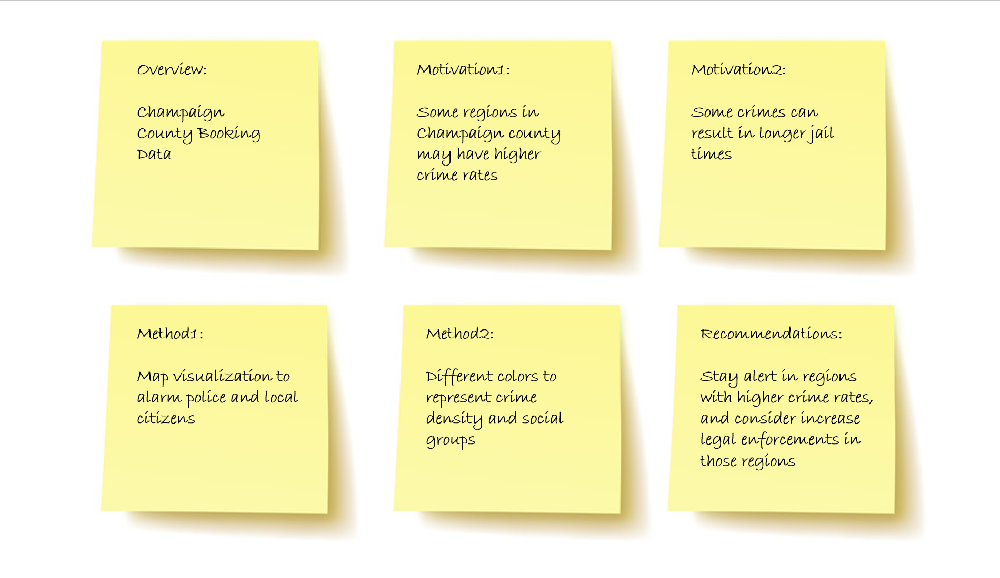

## Final Project Proposal 

- Group members' names: Qiqing Xu (qiqingx2), Eric Wang (wcwang2), Felix Zhu (zz6) 
- Tentative title of the project: Champaign County Booking Data Visualization 
- The databset: CCSO Bookings 
- Summary of the intentions and goals of the project: We seek to create a data visualization which summarizes Champaign County's booking data. Users are able to toggle filters to observe certain patterns within the dataset. Our intention is to identify regions with higher crime rates and inspect the relationship between crime type and jail time.
- Storyboard: 
